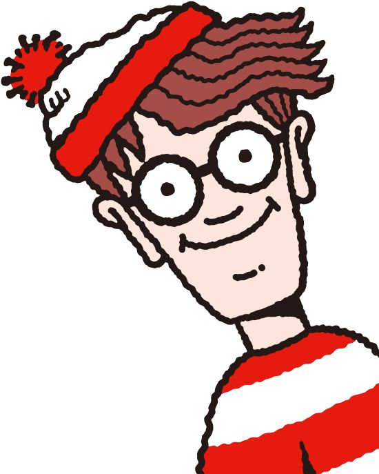
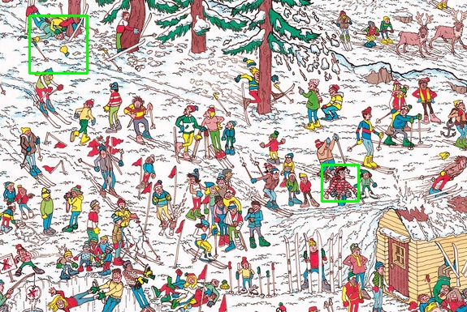
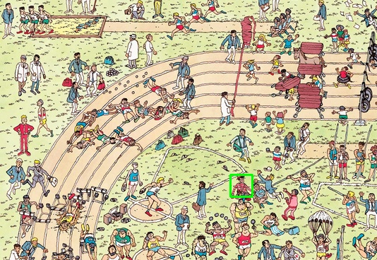

# Where is Wally utilizando el modelo Haar Cascade

## Contenido

1. [Objetivo](#objetivo)
2. [Teoría](#recursos)
3. [Recursos](#teoría)
4. [Proceso](#proceso)
5. [Resultados](#desarrollo)
    - [Generación de data set](#generación-del-data-set)
    - [Entramiento del modelo](#entrenamiento-del-modelo)
6. [Referencias](#resultados)

## Objetivo

Entrenar un programa que sea capaz de idenficar al pesonaje wally, usando la herramienta Cascade Trainer GUI
<br>
<!-- [Wally](../Recocimiento_Wally/imgs/wally.jpg) -->



## Teoría 

### Clasificador haar
Un clasificador es un algoritmo utilizado en el campo del reconocimiento de patrones y la visión por computadora para detectar objetos en imágenes digitales. Este algoritmo se basa en características visuales llamadas "características Haar", que son patrones rectangulares de intensidad de píxeles en una imagen. Estas características son calculadas en diferentes escalas y posiciones dentro de la imagen y se utilizan para entrenar un clasificador que puede distinguir entre regiones de la imagen que contienen el objeto de interés y las que no lo contienen. [[1]](#enlace-1)

El entrenamiento es realizado por la herramienta Train Cascade o entrenador de cascada en donde clasifica los datos en 2 tipos de muestra: imágenes positivas y negativas [[2]](#enlace-2)

### Muestras positivas

Se utilizan por el proceso de refuerzo para definir lo que el modelo debe buscar realmente al tratar de encontrar sus objetos de interés.

El primer enfoque toma una sola imagen de objeto con, por ejemplo, un logotipo de la empresa y crea un gran conjunto de muestras positivas de la imagen de objeto dada girando al azar el objeto, cambiando la intensidad de la imagen, así como colocando la imagen en fondos arbitrarios. La cantidad y el rango de aleatoriedad se pueden controlar con argumentos de línea de comandos de la aplicación opencv-creates

### Muestras negativas

Las muestras negativas se toman de imágenes arbitrarias, sin que contengan objetos que desee detectar. Estas imágenes negativas, de las que se generan las muestras, deben figurar en un archivo de imagen negativo especial que contenga una vía de imagen por línea (puede ser absoluta o relativa). Tenga en cuenta que las muestras negativas y las imágenes de muestra también se llaman muestras de fondo o imágenes de fondo, y se utilizan indistintamente en este documento.

Las imágenes descritas pueden ser de diferentes tamaños. Sin embargo, cada imagen debe ser igual o mayor que el tamaño deseado de la ventana de entrenamiento (que corresponde a las dimensiones del modelo, la mayoría de las veces es el tamaño medio de su objeto), porque estas imágenes se utilizan para submuestra una imagen negativa en varias muestras de imágenes con este tamaño de ventana de entrenamiento.


## Recursos

- [Dataset](https://www.dropbox.com/scl/fo/b4rmoheo98d76l7rgtfmw/ADFv90YhJKf260y8x9NQTAM?rlkey=ezrgumvp9ms1ckyj90wpjgmt8&st=agpcgznz&dl=0)
- [Cascade Trainer GUI](https://amin-ahmadi.com/cascade-trainer-gui/)

## Proceso

Las etapas para este proyectos fue fueron:
- Obtener las imágenes positivas y negativas de Wally.
- Modicar las imágenes para reducir el ruido y evitar falsos positivos
- Cargar datos en el Cascade Trainer GUI
- Entrenar al modelo con las imágenes positivas y negativas
- Cargar el archivo generado y probar el modelo


## Desarrollo

Para esta proyecto lo primero que se realizó fue realizar diferentes recortes de varias imágenes de los escenarios donde salia wally y se clasificaron las imágenes positivas donde apaarecía wally y las imágenes negativas donde no salia, pero eran escenarios donde se podría encontrar.

### Generación del data set

Una vez obtenida las imágenes se procedió a trabajar con ellas para reducir el ruido generando falsos positivos. 

Primeramente se procedió a procesar todas las imágenes a una escala de grises

Importación de las librerias

``` python
import os
import cv2 as cv
import numpy as np

``` 

Proceso para pasar todos los archivos a una escala de grises

``` python
def convert_to_gray(img, i):
    frame2 = cv.cvtColor(img, cv.COLOR_BGR2GRAY)
    cv.imwrite('new_dataset/n/wally'+str(i)+'.png', frame2)

i = 0
imgPaths = 'img/n'
nomFiles = os.listdir(imgPaths)
for nomFile in nomFiles:
    i = i+1
    imgPath=imgPaths+"/"+nomFile
    img = cv.imread(imgPath)
    convert_to_gray(img, i) 
``` 

Proceso para reducir el tamaño de las imágenes a un tamaño de 50x50

``` python
def resizeimg(img, i):
    frame2 = cv.resize(img, (50,50), interpolation = cv.INTER_AREA)
    cv.imwrite('dataset/new_p/positiva'+str(i)+'.png', frame2)

i = 0
imgPaths = 'img/n'
nomFiles = os.listdir(imgPaths)
for nomFile in nomFiles:
    i = i+1
    imgPath=imgPaths+"/"+nomFile
    img = cv.imread(imgPath)
    resizeimg(img, i) 
``` 

también se utilizaron 2 funciones para aumentar el número de imágenes positivas y negativas

Genera una copia de los archivos del directorio especificado con un rote de 45°

``` python
def rotar(img, i):
    h, w = img.shape[:2]
    mw = cv.getRotationMatrix2D((h//2, w//2), 360, -1)
    img2 = cv.warpAffine(img, mw, (h,w))
    cv.imwrite('imgs/wallyrotado'+str(i)+'.png', img2)
``` 

Genera una copia espejo de los archivos del directorio especificado

``` python

def espejo(img, i):
    # Crea una imagen espejo usando flip
    img_espejo = cv.flip(img, 1)
    # Guarda la imagen espejo
    cv.imwrite('wally/n/espejo'+str(i)+'.png', img_espejo)
``` 


### Entrenamiento del modelo

Una vez teniendo el dataset completo de imágenes positivas y negativas se procedió a cargar los datos en el Cascade Trainer GUI, especificando el número de imágenes positivas y negativas

Para saber el número exacto se utilzó el siguiente código

``` python
import os

# Especifica la ruta de las carpetas
folderP_path = 'new_dataset/p'
folder_path = 'new_dataset/n'

# Obtiene una lista de todos los archivos en cada carpeta
files = [f for f in os.listdir(folder_path) if os.path.isfile(os.path.join(folder_path, f))]
filesP = [f for f in os.listdir(folderP_path) if os.path.isfile(os.path.join(folderP_path, f))]

# Cuenta todos los archivos
num_files = len(files)
num_filesP = len(filesP)

print(f'Hay {num_files} archivos en la carpeta {folder_path}.')
print(f'Hay {num_filesP} archivos en la carpeta {folderP_path}.')
``` 

## Resultados

Una vez terminado el proceso de aprendizaje se genera un arhivo llamado cascade.xml, este lo genera en el diretorio raiz

Para poder leer el archivo generado se empleó el siguiente código

Carga la lectura del arhivo clasificador y establece a una escala de grises la imágen que se desea utilizar

``` python

import numpy as np
import cv2 as cv    
import math

wally = cv.CascadeClassifier('new_dataset/classifier/cascade.xml')

frame = cv.imread('pruebas/where-is-wally5.png')

gray = cv.cvtColor(frame, cv.COLOR_BGR2GRAY)

```

El metodo detectMultiScale devuelve una lista de rectángulos que representan las posibles ubicaciones de los objetos detectados. Este puede variar dependiendo del número de pixeles que pueda tener la imágen

```python

#Ajuste de vecinos
wallys = wally.detectMultiScale(gray, 1.03, 50)

for (x, y, w, h) in wallys:
    frame = cv.rectangle(frame, (x,y), (x+w, y+h), (0, 255, 0), 2)

cv.imwrite('pruebas/imgs/wally9.jpg', frame)
cv.imshow('Wally', frame)

cv.waitKey(0)
cv.destroyAllWindows()

``` 

Obtiendo asi los siguientes resultados

Ajuste de escala y vecidos para obtener el resultado de la suguiente imágen


Los resultado finales obtenidos con el archivo clasificador fueron los siguientes

``` python
wallys = wally.detectMultiScale(gray, 1.03, 50)
```


Ajuste de escala y vecidos para obtener el resultado de la siguiente imágen

``` python
wallys = wally.detectMultiScale(gray, 1.03, 30)
```


## Referencias

### Enlace 1:
https://repositorio.uci.cu/jspui/bitstream/ident/8353/2/TD_07043_13.pdf

### Enlace 2:
https://docs.opencv.org/4.3.0/dc/d88/tutorial_traincascade.html

