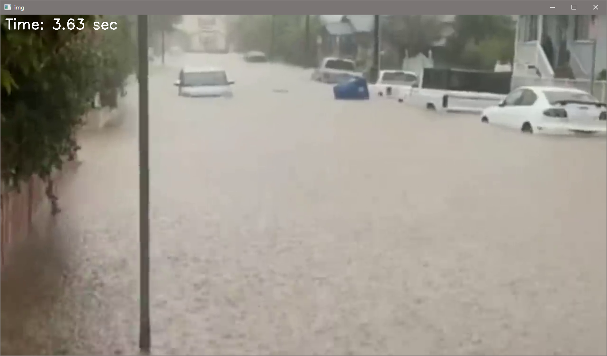

# Reconocimiento de riesgos usando Redes Neuronales 

## Contenido

1. [Objetivo](#objetivo)
2. [Teoría](#recursos)
3. [Recursos](#teoría)
4. [Proceso](#proceso)
5. [Resultados](#desarrollo)
    - [Generación de data set](#generación-del-data-set)
    - [Entramiento del modelo](#entrenamiento-del-modelo)
6. [Referencias](#resultados)

## Objetivo

Generar un programa capaz de identificar los riesgos: Tornados, Robos a casas, Incendios, Inundaciones, Asaltos. Usando redes convolucionales


## Teoría 

### Redes Neuronales Convolucionales

La Red Neuronal Convolucional (CNN) es una forma avanzada de Red Neuronal Artificial diseñada para el procesamiento de imágenes. Emula la manera en que el cortex visual humano procesa la información visual, lo que le permite identificar y clasificar distintas características en las imágenes. Esta capacidad la convierte en una herramienta eficaz para la “visión” computarizada y el reconocimiento de objetos.

Las CNN están compuestas por múltiples capas ocultas, cada una especializada y jerarquizada. Las capas iniciales suelen detectar elementos simples como líneas y curvas. A medida que la información avanza a través de la red, las capas subsiguientes procesan aspectos más complejos, como formas específicas y patrones. Esta progresión permite a las capas más profundas reconocer objetos más complejos, como rostros o siluetas animales.[[1]](#enlace-1)

### Tipos de capas de las CNN

Las CNN se distinguen de otras redes neuronales por su mejor desempeño con entradas de señal de imagen, voz o audio. Tienen tres tipos principales de capas, que son [[2]](#enlace-2):

- Capa convolucional
- Capa de agrupamiento
- Capa totalmente conectada (FC)

#### Capa convolucional 

La capa convolucional es el pilar central de una CNN, y es donde ocurre la mayor parte del cálculo. Requiere algunos componentes, que son datos de entrada, un filtro y un mapa de características. Supongamos que la entrada será una imagen en color, que se compone de una matriz de píxeles en 3D. Esto significa que la entrada tendrá tres dimensiones (altura, ancho y profundidad) que corresponden a RGB en una imagen.

También hay un detector de características, conocido como kernel o filtro, que se moverá a través de los campos receptivos de la imagen, verificando si la característica está presente. Este proceso se conoce como convolución.

#### Capa convolucional 

Otra capa de convolución puede seguir a la capa de convolución inicial. Cuando esto sucede, la estructura de la CNN puede convertirse en jerárquica, ya que las capas posteriores pueden ver los píxeles dentro de los campos receptivos de las capas anteriores.

#### Capa de agrupamiento 

La agrupación de capas, también conocida como reducción de muestreo, reduce la dimensionalidad y, por lo tanto, el número de parámetros en la entrada. De manera similar a la capa convolucional, la operación de agrupación muestra un filtro en toda la entrada, pero la diferencia es que este filtro no tiene pesos. En cambio, el kernel aplica una función de agregación a los valores dentro del campo receptivo, poblando la matriz de salida. Hay dos tipos principales de agrupación:

## Recursos

- [Dataset](https://drive.google.com/drive/folders/1rAfcFRXlehlLjMZrO9AyY0FBbiv13Wgc?usp=sharing)

## Proceso

Las etapas para este proyectos fue fueron:
- Generación del imágenes provenientes de varias categorias de varios videos.
- Modicar las imágenes para reducir el ruido y evitar fallos en los resultados
- Entrenar al modelo con el dataset
- Cargar el archivo generado y probar el modelo
- Obtener matriz de resultados de precisión
- Generar gráficos de resultados de precisión y perdida


## Desarrollo

Para el primer pasó fue generar alrededor de 6 mil capturas mínimod de cada riesgo, para ello se empleo el siguiente código

Primeramete se importan las librerias

``` python
import numpy as np
import cv2 as cv
import math 
import os
```

Se define la ruta con el con el video que se va reproducir, también se calculara el tiempo total del video para poder crear un acelerador de video y con esto poder adelantar el tiempo cada 5 seg.

``` python
# path = 'riesgoConRuido/incendios/incendio'
# path = 'riesgoConRuido/tornados/tornado'
path = 'riesgoConRuido/inundaciones/inundacion'
# path = 'riesgoConRuido/asaltos/asalto'
# path = 'riesgoConRuido/robos_a_casas/robocasa'

partes = path.split('/')
print(partes)

path_video = '/'.join(partes[-2:])
print(path_video)

acumulado = 2652

cap = cv.VideoCapture(f"videos/{path_video}1.mp4")
fps = cap.get(cv.CAP_PROP_FPS)  # Obtiene la velocidad de fotogramas
frames_to_skip = int(fps * 5)  # Calcula los fotogramas a adelantar (5 segundos)

i = 0

```

Una definida nuestras variables se procederá a guardar la imágenes en un en el directoria especificado de path, y con la teclas a se guardará una imágen del video mostrado, y con la tecla f se podrá adelatar cada 5 segundos el video.

``` python
while True:
    ret, frame = cap.read()
    if ret:
        # Muestra el tiempo transcurrido
        current_frame = int(cap.get(cv.CAP_PROP_POS_FRAMES))
        current_time = current_frame / fps
        time_text = f"Time: {current_time:.2f} sec"
        cv.putText(frame, time_text, (10, 30), cv.FONT_HERSHEY_SIMPLEX, 1, (255, 255, 255), 2)

        cv.imshow('img', frame)
        k = cv.waitKey(30)  # Aumenta este valor para hacer que el video se reproduzca más lento

        if k == ord('a'):
            i += 1
            cv.imwrite(f'imgs/{path}' + str(i+acumulado) + '.jpg', frame)
        
        if k == ord('f'):  # Adelanta 5 segundos 
            current_frame += frames_to_skip
            if current_frame >= cap.get(cv.CAP_PROP_FRAME_COUNT):
                break
            cap.set(cv.CAP_PROP_POS_FRAMES, current_frame)

        if k == 27:  # tecla ESC para salir
            break
    else:
        break

cap.release()
cv.destroyAllWindows()

```

Obtiendo asi el siguiente resultado



### Generación del data set

Una vez obtenida las imágenes del cada riesgo se procedió a adaptar las imágenes para elimiar el ruido que pueda haber y evitar fallos en la precisión


``` python
import cv2 as cv
import os


crop_top = 0.1
crop_bottom = 0.06
crop_left = 0.0 
crop_right = 0.0


def crop_image(img, i, file, nameFile):

    """Funcion para recortar el tiempo"""

    height, width = img.shape[:2]
    
    # Calcular las coordenadas de recorte
    start_row = int(crop_top * height)
    end_row = int((1 - crop_bottom) * height)
    start_col = int(crop_left * width)
    end_col = int((1 - crop_right) * width)
    
    cropped_img = img[start_row:end_row, start_col:end_col]

    path = f'imgs/riesgoSinRuido/{file}NR'

    if not os.path.exists(path):
        os.makedirs(path)

    cv.imwrite(f'{path}/{nameFile}'+str(i)+'.png', cropped_img)


def resizeimg(img, i, file, nameFile):
    
    """Funcion para redimensionar imagen a 28x21 px"""

    path = f'imgs/riesgo/{file}Reduce'

    if not os.path.exists(path):
        os.makedirs(path)

    frame2 = cv.resize(img, (28,21), interpolation = cv.INTER_AREA)

    cv.imwrite(f'{path}/{nameFile}reduce'+str(i)+'.png', frame2)


def espejo(img, i, file, nameFile):
    # Crea una imagen espejo usando flip

    path = f'imgs/riesgo/{file}Mirror'

    if not os.path.exists(path):
        os.makedirs(path)

    img_espejo = cv.flip(img, 1)
    # Guarda la imagen espejo
    cv.imwrite(f'{path}/{nameFile}mirror'+str(i)+'.png', img_espejo)


####################### Funciones Globales ###################################

path_general = './imgs/riesgoSinRuido'


## Eliminar Ruido de imagenes

def crop_all_images(file):
    i = 0
    imgPaths = f'./imgs/riesgoConRuido/{file}'
    nomFiles = os.listdir(imgPaths)

    for nomFile in nomFiles:
        i = i+1
        imgPath=imgPaths+"/"+nomFile
        img = cv.imread(imgPath)        
        nameFile = removeNum_and_Type(nomFile)
        crop_image(img, i, file, nameFile)
        nameFile = ''


## Redimensionar imagenes

def resize_all_images(file):

    i = 0
    imgPaths = f'{path_general}/{file}NR'
    nomFiles = os.listdir(imgPaths)
    for nomFile in nomFiles:
        
        i = i+1
        imgPath=imgPaths+"/"+nomFile
        img = cv.imread(imgPath)
        nameFile = removeNum_and_Type(nomFile)
        resizeimg(img, i, file, nameFile) 
        nameFile = ''

## Generar imágenes espejo

def mirror_all_images(file):
    i = 0
    imgPaths = f'./imgs/riesgo/{file}Reduce'
    nomFiles = os.listdir(imgPaths)
    for nomFile in nomFiles:
        i = i+1
        imgPath=imgPaths+"/"+nomFile
        img = cv.imread(imgPath)
        nameFile = removeNum_and_Type(nomFile)
        espejo(img, i, file, nameFile) 
        nameFile = ''
```

El proceso de ejecución que se llevó para cada función fue el siguiente

``` python
files  = os.listdir('./imgs/riesgoConRuido/')


for file in files:
        
    # llama funcion para recortar imagenes
    # crop_all_images(file)

    # llama funcion para redimensionar imagenes
    resize_all_images(file)

    # # llama funcion para obtener espejo imagenes
    # mirror_all_images(file)
        
```

### Entrenamiento del modelo

Una vez generado las imágenes se procedió a entrenar el modelo

Carga de imágenes al modelo y se crean las etiquetas

``` python
dirname = os.path.join(os.getcwd(),'./desastres')
imgpath = dirname + os.sep 

images = []
directories = []
dircount = []
prevRoot=''
cant=0

print("leyendo imagenes de ",imgpath)

for root, dirnames, filenames in os.walk(imgpath):
    for filename in filenames:
        if re.search("\.(jpg|jpeg|png|bmp|tiff)$", filename):
            cant=cant+1
            filepath = os.path.join(root, filename)
            image = plt.imread(filepath)
            if(len(image.shape)==3):
                
                images.append(image)
            b = "Leyendo..." + str(cant)
            print (b, end="\r")
            if prevRoot !=root:
                print(root, cant)
                prevRoot=root
                directories.append(root)
                dircount.append(cant)
                cant=0
dircount.append(cant)

dircount = dircount[1:]
dircount[0]=dircount[0]+1
print('Directorios leidos:',len(directories))
print("Imagenes en cada directorio", dircount)
print('suma Total de imagenes en subdirs:',sum(dircount))

labels=[]
indice=0
for cantidad in dircount:
    for i in range(cantidad):
        labels.append(indice)
    indice=indice+1
print("Cantidad etiquetas creadas: ",len(labels))
```

Se crea el modelo

``` python
#declaramos variables con los parámetros de configuración de la red
INIT_LR = 1e-3 # Valor inicial de learning rate. El valor 1e-3 corresponde con 0.001
epochs = 20 # Cantidad de iteraciones completas al conjunto de imagenes de entrenamiento
batch_size = 64 # cantidad de imágenes que se toman a la vez en memoria

sport_model = Sequential()
sport_model.add(Conv2D(32, kernel_size=(3, 3),activation='linear',padding='same',input_shape=(28,28,3)))
sport_model.add(LeakyReLU(alpha=0.1))
sport_model.add(MaxPooling2D((2, 2),padding='same'))
sport_model.add(Dropout(0.5))


sport_model.add(Flatten())
sport_model.add(Dense(32, activation='linear'))
sport_model.add(LeakyReLU(alpha=0.1))
sport_model.add(Dropout(0.5))
sport_model.add(Dense(nClasses, activation='softmax'))

sport_model.summary()
```

Se entrana el modelo en base a la clasificación de etiquetas y se guarda el un artivo .h5

``` python
sport_train = sport_model.fit(
    train_X, train_label,
    batch_size=batch_size,
    epochs=epochs,
    verbose=1,
    validation_data=(valid_X, valid_label)
)

sport_model.save("riesgos.h5")
```


Se determina los valores de validación de precisión y perdida

``` python

accuracy = sport_train.history['accuracy']
val_accuracy = sport_train.history['val_accuracy']
loss = sport_train.history['loss']
val_loss = sport_train.history['val_loss']
epochs = range(len(accuracy))
plt.plot(epochs, accuracy, 'bo', label='Training accuracy')
plt.plot(epochs, val_accuracy, 'b', label='Validation accuracy')
plt.title('Training and validation accuracy')
plt.legend()
plt.figure()
plt.plot(epochs, loss, 'bo', label='Training loss')
plt.plot(epochs, val_loss, 'b', label='Validation loss')
plt.title('Training and validation loss')
plt.legend()
plt.show()

```


Se obtiene la matriz de los valores de precisión

``` python

target_names = ["Class {}".format(i) for i in range(nClasses)]
print(classification_report(test_Y, predicted_classes, target_names=target_names))

```


### Resultados

Una vez obtenido los valores procedemos a cargar el archivo que generó el entrenamiento del modelo se utilizó el siguiente código

``` python

from skimage.transform import resize
import cv2 as cv
import matplotlib.pyplot as plt
import numpy as np
from keras.models import load_model

# Cargar el modelo
model_path = 'riesgos.h5'  # Actualiza esta ruta con la ubicación de tu archivo .h5
sport_model = load_model(model_path)

# Lista de imágenes a procesar
# filenames = ['pruebas/asaltos/asalto6.jpg']
# filenames = ['pruebas/robo_casa/robocasa4.jpg']
# filenames = ['pruebas/incendios/incendio1.jpg']
# filenames = ['pruebas/inundaciones/inundacion2.jpg']
filenames = ['pruebas/tornados/tornado2.jpg']

# Definir las categorías de riesgo (debes ajustar esto a las categorías de tu modelo)
riesgos = ['Asaltos', 'Incendios', 'Inundaciones', 'Robo casa habitacion', 'Tornados']

images = []

frame = cv.imread(filenames[0])

for filepath in filenames:
    image = plt.imread(filepath, 0)
    image_resized = resize(image, (21, 28), anti_aliasing=True, clip=False, preserve_range=True)
    images.append(image_resized)

X = np.array(images, dtype=np.uint8)  # Convertir de lista a numpy
test_X = X.astype('float32')
test_X = test_X / 255.

# Hacer predicciones
predicted_classes = sport_model.predict(test_X)

# Obtener el resultado y mostrarlo
resultado = ""
for i, img_tagged in enumerate(predicted_classes):
    print(filenames[i], riesgos[img_tagged.tolist().index(max(img_tagged))])
    resultado = riesgos[img_tagged.tolist().index(max(img_tagged))]

print(resultado)

cv.imshow("riesgo:" + resultado, frame)
cv.waitKey(0)
cv.destroyAllWindows()

```

Los resultados obtenidos fueron:

- Asalto<br>
 <br>
- Inundación <br>
<br>
- Incendio <br>
<br>
- Robo casa habitación <br>
<br>
- Tornados <br>
<br>


## Referencias

### Enlace 1:
https://github.com/eAlcaraz85/vpcurso?tab=readme-ov-file#haarcascades

### Enlace 2:
https://www.ibm.com/mx-es/topics/convolutional-neural-networks
