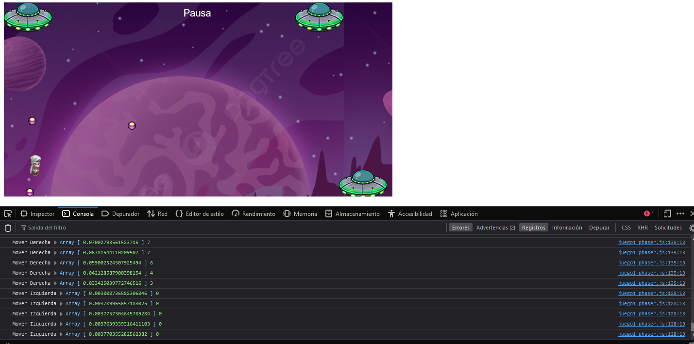

# Juego 1 utilizando phaser y synaptic

## Contenido

1. [Objetivo](#objetivo)
2. [Teoría](#recursos)
3. [Recursos](#teoría)
4. [Proceso](#proceso)
5. [Resultados](#desarrollo)
    - [Desarrollo del juego](#desarrollo-del-juego)
    - [Entramiento del modelo](#entrenamiento-del-modelo)
6. [Referencias](#resultados-del-entrenamiento)

## Objetivo

Realizar un juego que sea entrenado con el juego del jugador utilizando el framework phaser y la librería synaptic capaz de esquivar las balas de 3 naves diferentes


## Teoría 

### Red neuronal

Una red neuronal es un método de la inteligencia artificial que enseña a las computadoras a procesar datos de una manera que está inspirada en la forma en que lo hace el cerebro humano. Se trata de un tipo de proceso de machine learning llamado aprendizaje profundo, que utiliza los nodos o las neuronas interconectados en una estructura de capas que se parece al cerebro humano. Crea un sistema adaptable que las computadoras utilizan para aprender de sus errores y mejorar continuamente [[1]](#enlace-1).

Una red neuronal básica tiene neuronas artificiales interconectadas en tres capas:

- Capas de entrada
- Capas ocultas
- Capas de salida

### Perceptron

Las redes neuronales se pueden clasificar en diferentes tipos, que se utilizan para diferentes propósitos. Si bien esta no es una lista completa de tipos, la siguiente sería representativa de los tipos más comunes de redes neuronales que encontrará para sus casos de uso comunes:

El perceptrón es la red neuronal más antigua, creada por Frank Rosenblatt en 1958.

Las redes neuronales de retroalimentación, o perceptrones multicapa (MLP), son en lo que nos hemos centrado principalmente en este artículo. Se componen de una capa de entrada, una capa o capas ocultas y una capa de salida. Si bien estas redes neuronales también se conocen comúnmente como MLP,


## Recursos

- [Phaser Doc](https://phaser.io/)
- [Synaptic](https://caza.la/synaptic/#/)

## Proceso

Las etapas para este proyectos fue fueron:
- Desarrollar un videojuego usando el framework de phaser
- Utilizar la liberia de synaptic para entrenar a la IA
- Crear funcionalidad para entrenar al programa definiendo los perceptrones necesarios
- Probar el modelo entreno entrenado


## Desarrollo

Para este proyecto primeramente se contruyo el escenario y se cargaron los objetos aplicando la funcilidad physics del framework.

### Desarrollo del juego

El framework phaser maneja 3 funciones prinpales que son:

preload()  -> Carga los elementos al objeto Phaser
create() -> Inicia los elementos y físicas al juego
update()  -> Función que se actualizá de forma constante y captura las eventos en el juego


Primeramete se definieron las imágenes y sprites del juego

``` js
    function preload() {
        juego.load.image('fondo', 'assets/game/fondo.png');
        juego.load.spritesheet('mono', 'assets/sprites/altair.png', 32, 48);
        juego.load.image('nave', 'assets/game/ufo.png');
        juego.load.image('bala', 'assets/sprites/purple_ball.png');
        juego.load.image('menu', 'assets/game/menu.png');
    }
```

En la función create se inicializaron las objetos y se definió la física de cada elemento y se cargaron los objetos de la libreria synaptic para trabajar con las redes neuronales

``` js
    function create() {
        juego.physics.startSystem(Phaser.Physics.ARCADE);
        juego.physics.arcade.gravity.y = 800;
        juego.time.desiredFps = 30;

        // Definicacón de elementos que se cargarán en el escenario   
        fondo = juego.add.tileSprite(0, 0, anchoJuego, altoJuego, 'fondo');
        nave1 = juego.add.sprite(anchoJuego - 110, altoJuego - 55, 'nave');
        nave2 = juego.add.sprite(anchoJuego - 800, altoJuego - 400, 'nave');
        nave3 = juego.add.sprite(anchoJuego - 200, altoJuego - 400, 'nave');
        bala1 = juego.add.sprite(anchoJuego - 100, altoJuego, 'bala');
        jugador = juego.add.sprite(50, altoJuego,'mono');
        etiquetaPausa = juego.add.text(anchoJuego - 430, 10, 'Pausa', { font: '20px Arial', fill: '#fff' });
        etiquetaPausa.inputEnabled = true;

        // Definicón de física de elementos
        juego.physics.enable(bala1);
        juego.physics.enable(bala2);
        juego.physics.enable(bala3);
        bala1.body.collideWorldBounds = true;
        bala2.body.collideWorldBounds = false;
         bala3.body.collideWorldBounds = false;

        //Definición de teclas que capturaran los eventos
        teclaSaltar = juego.input.keyboard.addKey(Phaser.Keyboard.SPACEBAR);
        teclaIzquierda = juego.input.keyboard.addKey(Phaser.Keyboard.A);
        teclaDerecha = juego.input.keyboard.addKey(Phaser.Keyboard.D);

        // Definición de los perceptrones
        redNeuronalSaltar = new synaptic.Architect.Perceptron(2, 8, 8, 1);
        entrenamientoSaltar = new synaptic.Trainer(redNeuronalSaltar);

        redNeuronalMoverIzquierda = new synaptic.Architect.Perceptron(3, 8, 8, 1);
        entrenamientoMoverIzquierda = new synaptic.Trainer(redNeuronalMoverIzquierda);

        redNeuronalMoverDerecha = new synaptic.Architect.Perceptron(2, 8, 8, 1);
        entrenamientoMoverDerecha = new synaptic.Trainer(redNeuronalMoverDerecha);
    }
```

En la función update se creo la lógica para generar las acciones del juego así como se definió el entrenamiento del los perceptrones

``` js
    fondo.tilePosition.x -= 1;

    // Físicas del juego
    juego.physics.arcade.collide(bala1, jugador, manejarColision, null, this);
    juego.physics.arcade.collide(bala2, jugador, manejarColision, null, this);
    juego.physics.arcade.collide(bala3, jugador, manejarColision, null, this);

    bala3.body.velocity.y = 80;
    bala3.body.position.x -= 5;

    // Calculo de distancias
    desplazamientoBala = Math.floor(jugador.position.x - bala1.position.x);
    desplazamientoBala2 = Math.floor(jugador.position.y - bala2.position.y);
    desplazamientoBala3 = Math.floor(jugador.position.x - bala3.position.x);
    desplazamientoBala3b = Math.floor(jugador.position.y - bala3.position.y);

    if (!modoAutomatico && teclaSaltar.isDown && jugador.body.onFloor()) {
        saltar();
    }

    if (!modoAutomatico && teclaIzquierda.isDown) {
        moverIzquierda();
    }

    if (!modoAutomatico && teclaDerecha.isDown) {
        moverDerecha();
    }

    if (moviendoIzquierda) {
        if (bala1.body.position.x > 600 && bala2.body.position.y < 280 && bala3.body.position.y < 280) {
            moverDerecha();
        }
    }

```

Una vez definido las acciones en las 3 funciónes, podermos empezar ahora si con la definición del entrenamiento.

Despues de definifir nuestros perceptrones estos se deben declaran dentro de la la función update para poder entrenarlos con las acciones del juegador para ello definiremos una bandera para poder determinar los estados del personaje

``` js

    enSuelo = 1;
    enAire = 0;

    estadoDerecha = 0;
    estadoIzquierda = 0;

    if (!jugador.body.onFloor()) {
        enSuelo = 0;
        enAire = 1;
        moverDerechaEnAire = 1;
    } else {
        moverDerechaEnAire = 0;
    }

    // Calculo de posiciones 

    desplazamientoBala = Math.floor(jugador.position.x - bala1.position.x);
    desplazamientoBala2 = Math.floor(jugador.position.y - bala2.position.y);
    desplazamientoBala3 = Math.floor(jugador.position.x - bala3.position.x);
    desplazamientoBala3b = Math.floor(jugador.position.y - bala3.position.y);

    // Procesos para entrenar los perceptrones

    if (!modoAutomatico && bala2.position.y > 100 && desplazamientoBala2 > 0) {
        datosEntrenamientoMoverIzquierda.push({
            'input': [desplazamientoBala2, jugador.position.x, bala2.position.x],
            'output': [estadoIzquierda]
        });
    }

    if (!modoAutomatico && bala3.position.y > 200 && bala3.position.x > 0) {
        datosEntrenamientoMoverDerecha.push({
            'input': [desplazamientoBala3, desplazamientoBala3b],
            'output': [estadoIzquierda]
        });
    }

    if (!modoAutomatico && bala1.position.x > 0) {
        datosEntrenamientoSaltar.push({
            'input': [desplazamientoBala, velocidadBala],
            'output': [enAire]
        });
    }

```

Estas 3 últimas funciones serán las encargadas de capturar los datos recibidos de la diferencias entre la bala y el personaje 

### Entrenamiento del modelo

El framework posee una función para pausar el escenario, esta función la utilizaremos para entrenar al modelo cuando el usuario seleccione la opción "automode"

``` js

function entrenarRedNeuronal() {
    entrenamientoSaltar.train(datosEntrenamientoSaltar, { rate: 0.0003, iterations: 5000, shuffle: true });
    entrenamientoMoverIzquierda.train(datosEntrenamientoMoverIzquierda, { rate: 0.0003, iterations: 5000, shuffle: true });
    entrenamientoMoverDerecha.train(datosEntrenamientoMoverDerecha, { rate: 0.0003, iterations: 5000, shuffle: true });
}

function reanudarJuego(evento) {
    if (juego.paused) {
        var menuX1 = anchoJuego / 2 - 270 / 2, menuX2 = anchoJuego / 2 + 270 / 2,
            menuY1 = altoJuego / 2 - 180 / 2, menuY2 = altoJuego / 2 + 180 / 2;

        var mouseX = evento.x,
            mouseY = evento.y;

        if (mouseX > menuX1 && mouseX < menuX2 && mouseY > menuY1 && mouseY < menuY2) {
            if (mouseX >= menuX1 && mouseX <= menuX2 && mouseY >= menuY1 && mouseY <= menuY1 + 90) {
                entrenamientoCompleto = false;
                datosEntrenamientoSaltar = [];
                modoAutomatico = false;
            } else if (mouseX >= menuX1 && mouseX <= menuX2 && mouseY >= menuY1 + 90 && mouseY <= menuY2) {
                if (!entrenamientoCompleto) {
                    entrenarRedNeuronal();
                    entrenamientoCompleto = true;
                    jugador.position.x = 50;
                }
                modoAutomatico = true;
            }
            menuPausa.destroy();
            resetearVariablesJuego();
            juego.paused = false;
        }
    }
}

```

La función entrenarRedNeuronal() define los valores que va recibir el perceptron y el número de iteraciones, y va tener una sola salida por lo que su función de activación será la sigmoide.

## Resultados del entrenamiento


Una vez entrenado el modelo procederemos ahora si a capturar las acciones cuando cuando se active su función activadora

``` js
    function obtenerDatosSaltar(parametrosEntrada) {
        salidaRedNeuronal = redNeuronalSaltar.activate(parametrosEntrada);
        var porcentajeAire = Math.round(salidaRedNeuronal[0] * 100);
        return porcentajeAire >= 40;
    }

    function obtenerDatosMoverIzquierda(parametrosEntrada) {
        salidaRedNeuronalMoverIzquierda = redNeuronalMoverIzquierda.activate(parametrosEntrada);    
        const resultado = Math.round(salidaRedNeuronalMoverIzquierda[0] * 100);
        console.log("RN Mover Izquierda", salidaRedNeuronalMoverIzquierda, resultado);
        return resultado > 20;
    }

    function obtenerDatosMoverDerecha(parametrosEntrada) {
        salidaRedNeuronalMoverDerecha = redNeuronalMoverDerecha.activate(parametrosEntrada);
        const resultado = Math.round(salidaRedNeuronalMoverDerecha[0] * 100);
        return resultado >= 9;
    }
    
```

Estás serán llamadas dentro de la función update cuando el modeAuto sea verdadero

``` js
function update() {

    /// ... Resto de código

    if (modoAutomatico && bala2.position.y > 200) {
        const resultado = obtenerDatosMoverIzquierda([desplazamientoBala2, jugador.position.x, bala2.position.x]);
        if (resultado) {
            moverIzquierda();
        }
    }

    if (modoAutomatico && bala3.position.y > 300 && bala3.position.x > 0) {
        if (obtenerDatosMoverDerecha([desplazamientoBala3, desplazamientoBala3b])) {
            moverIzquierda();
            console.log("RN Mover Izquierda");
        }
    }

    if (modoAutomatico && bala1.position.x > 0 && jugador.body.onFloor()) {
        if (obtenerDatosSaltar([desplazamientoBala, velocidadBala])) {
            saltar();
        }
    }
}
```

y con eso tenermos ya entrenados nuestros 3 perceptrones para cada bala uno para cuando salta, otro cuando se mueve a la izquieda y otro cuando se mueve a la derecha



En la terminal de js se ven los datos que arroja el resultado la función activadora

## Referencias

### Enlace 1:
https://aws.amazon.com/es/what-is/neural-network/


