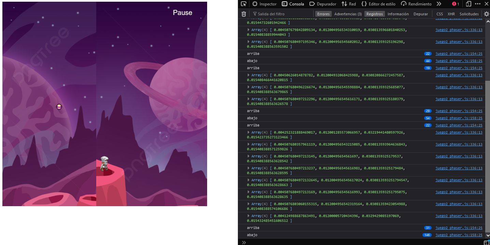

# Juego 2 utilizando phaser y synaptic

## Contenido

1. [Objetivo](#objetivo)
2. [Teoría](#recursos)
3. [Recursos](#teoría)
4. [Proceso](#proceso)
5. [Resultados](#desarrollo)
    - [Desarrollo del juego](#desarrollo-del-juego)
    - [Entramiento del modelo](#entrenamiento-del-modelo)
6. [Referencias](#resultados-del-entranamiento)

## Objetivo

Realizar un juego que sea entrenado con el juego del jugador utilizando el framework phaser y la librería synaptic capaz de esquivar la colisión de rebote de una pelota


## Teoría 

### Red neuronal

Una red neuronal es un método de la inteligencia artificial que enseña a las computadoras a procesar datos de una manera que está inspirada en la forma en que lo hace el cerebro humano. Se trata de un tipo de proceso de machine learning llamado aprendizaje profundo, que utiliza los nodos o las neuronas interconectados en una estructura de capas que se parece al cerebro humano. Crea un sistema adaptable que las computadoras utilizan para aprender de sus errores y mejorar continuamente [[1]](#enlace-1).

Una red neuronal básica tiene neuronas artificiales interconectadas en tres capas:

- Capas de entrada
- Capas ocultas
- Capas de salida

### Perceptron

Las redes neuronales se pueden clasificar en diferentes tipos, que se utilizan para diferentes propósitos. Si bien esta no es una lista completa de tipos, la siguiente sería representativa de los tipos más comunes de redes neuronales que encontrará para sus casos de uso comunes:

El perceptrón es la red neuronal más antigua, creada por Frank Rosenblatt en 1958.

Las redes neuronales de retroalimentación, o perceptrones multicapa (MLP), son en lo que nos hemos centrado principalmente en este artículo. Se componen de una capa de entrada, una capa o capas ocultas y una capa de salida. Si bien estas redes neuronales también se conocen comúnmente como MLP,


## Recursos

- [Phaser Doc](https://phaser.io/)
- [Synaptic](https://caza.la/synaptic/#/)

## Proceso

Las etapas para este proyectos fue fueron:
- Desarrollar un videojuego usando el framework de phaser
- Utilizar la liberia de synaptic para entrenar a la IA
- Crear funcionalidad para entrenar al programa definiendo los perceptrones necesarios
- Probar el modelo entreno entrenado


## Desarrollo

Para este proyecto primeramente se contruyo el escenario y se cargaron los objetos aplicando la funcilidad physics del framework.

### Desarrollo del juego

El framework phaser maneja 3 funciones prinpales que son:

preload()  -> Carga los elementos al objeto Phaser
create() -> Inicia los elementos y físicas al juego
update()  -> Función que se actualizá de forma constante y captura las eventos en el juego


Primeramete se definieron las imágenes y sprites del juego

``` js
    function preload() {
        juego.load.image('fondo', 'assets/game/fondo.png');
        juego.load.spritesheet('mono', 'assets/sprites/altair.png', 32, 48);
        juego.load.image('bala', 'assets/sprites/purple_ball.png');
        juego.load.image('menu', 'assets/game/menu.png');
    }
```

En la función create se inicializaron las objetos y se definió la física de cada elemento y se cargaron los objetos de la libreria synaptic para trabajar con las redes neuronales

``` js
    function create() {
         // Setup of physics
        game.physics.startSystem(Phaser.Physics.ARCADE);
        game.physics.arcade.gravity.y = 0;

        // Objects with physics
        background = game.add.tileSprite(0, 0, canvasWidth, canvasHeight, 'background');
        bullet = game.add.sprite(canvasWidth - 100, canvasHeight / 2, 'bullet');
        player = game.add.sprite(canvasWidth / 2, canvasHeight / 2, 'character');

        game.physics.enable(player);
        game.physics.enable(bullet);

        player.body.collideWorldBounds = true;
        bullet.body.collideWorldBounds = true;

        // Make the bullet bounce
        bullet.body.bounce.set(1);

        // Set a random initial velocity for the bullet
        bullet.body.velocity.setTo(randomSpeed(200, 300), randomSpeed(200, 300));

        // Set animation of run
        var run = player.animations.add('run', [8, 9, 10, 11]);
        player.animations.play('run', 10, true);

        // Actions of stop
        pauseLabel = game.add.text(canvasWidth - 100, 20, 'Pause', { font: '20px Arial', fill: '#fff' });
        pauseLabel.inputEnabled = true;
        pauseLabel.events.onInputUp.add(pause, this);
        game.input.onDown.add(pauseClick, this);

        // Actions of physics
        left = game.input.keyboard.addKey(Phaser.Keyboard.A);
        right = game.input.keyboard.addKey(Phaser.Keyboard.D);
        down = game.input.keyboard.addKey(Phaser.Keyboard.S);
        up = game.input.keyboard.addKey(Phaser.Keyboard.W);
        keyescape = game.input.keyboard.addKey(Phaser.Keyboard.ESC);

        // Variables trainer
        nnNetwork = new synaptic.Architect.Perceptron(4, 8, 8, 4);
        nnTraining = new synaptic.Trainer(nnNetwork);
    }
```

Para esta ocasión solo requeriremos de un perceptón que va determinar cuando la bala se encuentre cerca del personaje.

En la función create crearmos la lógica del juego para crear un el escenario y hacer que el personaje se pueda mover libremente por el mapa. 

Ahora en la fucnión update definiremos las acciones que tendrá el personaje

``` js
    function update() {

    tpCentro()
    // Displacement of the scene
    background.tilePosition.x -= 1;

    // Physics of the collide
    handleBulletCollisions();

    // Update bullet movement
    handleBulletMovement();

    if (!autoMode) {
        // Actions of keypress
        handlePlayerActions();
    }

    /* Operations from Trainer */

    // Distance between the bullets and the player
    bulletDistancex = Math.floor(player.position.x - bullet.position.x);
    bulletDistancey = Math.floor(player.position.y - bullet.position.y);

    groundStatus = 1;
    airStatus = 0;
    progress = 0;
    still = 1;

    var distanciaBolaX = bullet.x - player.x;
    var distanciaBolaY = bullet.y - player.y;        
    var cuadrante = getCuadrante(distanciaBolaX,distanciaBolaY)

    const distance = Math.sqrt(Math.pow(bullet.x - player.x, 2) + Math.pow(bullet.y - player.y, 2));    


}

```

Como no queremos que el personaje se quede en la orillas crearemos una funión para tepearlo al centro del escenario para eso llamaremos la misma función cuando se inicializa el juego

``` js
function tpCentro(){
    if(
        player.position.x > (560) ||
        player.position.x < 20 ||
        player.position.y < 20 ||
        player.position.y > (550)
    ){
        handlePlayerMovement()
    }
}

/* Handlers from update */
function handlePlayerMovement() {
    player.x = canvasWidth / 2 - player.width / 2;
    player.y = canvasHeight / 2 - player.height / 2;
}


```

La función reset variables se llamara cuando el juego este en pausa para regresar al personaje a su posición inicial

``` js


function resetVariables() {
    // Prevent bounce of player
    player.body.velocity.x = 0;
    player.body.velocity.y = 0;
    player.position.x = 50;

    //bullet.body.velocity.x = 0;
    //bullet.position.x = canvasWidth - 100;

    bullet.x = bulllet_x
    bullet.y = bulllet_y

    handlePlayerMovement()
    bulletD = false;
}


function handleBulletCollisions() {
    game.physics.arcade.collide(bullet, player, collisionHandler, null, this);
}
```

### Entrenamiento del modelo

Una vez definido las acciones en las 3 funciónes, podermos empezar ahora si con la definición del entrenamiento. 

Primera en la función create definiremos nuestro percetron que recibirá 4 entradas y tendrá 4 salidas para determinar la dirección del cuadrante que tomará.

``` js
function create(){

    //Resto del código...

    // Variables trainer
    nnNetwork = new synaptic.Architect.Perceptron(4, 8, 8, 4);
    nnTraining = new synaptic.Trainer(nnNetwork);
}
    
```

Dentro de la función update crearemos una variable que va indicar el cuadrante esto para saber hacer qué dirección está bola.

Esta función recibirá las posiciones de 'x' y 'y' de la de la distancia entre el pesonaje y la bola.

``` js
funtion update(){

    // Resto de código ... 

    var distanciaBolaX = bullet.x - player.x;
    var distanciaBolaY = bullet.y - player.y;        
    var cuadrante = getCuadrante(distanciaBolaX,distanciaBolaY)

    const distance = Math.sqrt(Math.pow(bullet.x - player.x, 2) + Math.pow(bullet.y - player.y, 2));  

}

function getCuadrante(x, y) {
    if (x > 0 && y < 0) {
        return 1;
    } else if (x < 0 && y < 0) {
        return 2;
    } else if (x < 0 && y > 0) {
        return 3;
    } else if (x > 0 && y > 0) {
        return 4;
    }
    return 0
}

```

Luego estos datos irán alimentando a la red neuronal cuando el juego no es este modo auto.

``` js
funtion update(){

    // Resto de código ... 

    
    if (!autoMode) {
        if ( distance < 300) {
            trainingData.push({
                'input': [cuadrante,distance, bullet.x, bullet.y],
                'output': [statusmoveRight, statusmoveLeft, statusmoveUp, statusmoveDown]
            });

            // console.log('output', statusmoveRight, statusmoveLeft, statusmoveUp, statusmoveDown);
        }
    }

}

```

## Resultados del entranamiento


Una vez entrenado el modelo procederemos ahora si a capturar las acciones cuando cuando se active su función activadora, esto se llamará cuando se llame la función pausa del juego

``` js

    function pauseClick(event) {
        if (game.paused) {
            var menu_x1 = canvasWidth / 2 - 270 / 2,
                menu_x2 = canvasWidth / 2 + 270 / 2,
                menu_y1 = canvasHeight / 2 - 180 / 2,
                menu_y2 = canvasHeight / 2 + 180 / 2;

            var mouse_x = event.x,
                mouse_y = event.y;

            if (mouse_x > menu_x1 && mouse_x < menu_x2 && mouse_y > menu_y1 && mouse_y < menu_y2) {
                if (mouse_x >= menu_x1 && mouse_x <= menu_x2 && mouse_y >= menu_y1 && mouse_y <= menu_y1 + 90) {
                    // Reset Variables
                    trainingComplete = false;
                    trainingData = [];
                    autoMode = false;
                } else if (mouse_x >= menu_x1 && mouse_x <= menu_x2 && mouse_y >= menu_y1 + 90 && mouse_y <= menu_y2) {
                    if (!trainingComplete) {
                        console.log('Entrenamiento data: ', trainingData.length);
                        neuralNetworTraining();
                        trainingComplete = true;
                    }
                    autoMode = true;
                }

                menu.destroy();
                resetVariables();
                game.paused = false;
            }
        }
    }

    function neuralNetworTraining() {
        nnTraining.train(trainingData, { rate: 0.0003, iterations: 5000, shuffle: true });
    }

    
    
```

Una vez terminado el proceso de entrenamiento, dentro de la función update se obtenienen los valores en base a la función activadora del perceptron que en base a su respuesta se determina el movimiento que debe ejecutar


``` js

    function gettrainingData(param_input) {
        nnOutput = nnNetwork.activate(param_input);
        let result = Math.round(nnOutput[0] * 100);
        const max_value = Math.max(...nnOutput)
        
        if (max_value > 0.04){    
            return nnOutput.indexOf(max_value)    
        }
        //return result >= 40;
        console.log(nnOutput);
    }


    function update() {

        // Actions in mode auto = true
        if (autoMode == true && distance < 150) {
            const result = gettrainingData([cuadrante,distance,bullet.x, bullet.y])
            //if (gettrainingData([bulletDistancey,bulletDistancex,distance])) {

                switch(result){
                    case 0: //Right
                    console.log("derecha");
                    moveRight()
                    break;
                    case 1: //Left
                    console.log("izquierda");
                    moveLeft()
                    break;
                    case 2: //Up
                    console.log("arriba");
                    moveUp()
                    break;
                    case 3: //Down
                    console.log("abajo");
                    moveDown()
                    break;
                }
            //}
        }
        statusmoveRight = statusmoveLeft = statusmoveUp = statusmoveDown = 0
    }

```

Imgen del juego terminado




## Referencias

### Enlace 1:
https://aws.amazon.com/es/what-is/neural-network/


