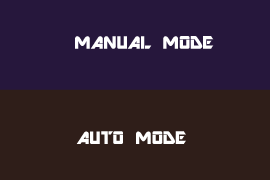

# Documentación del juego phaser

## Configuración del phaser

Para poder iniciar el proyecto es necesario crear primeramente el objeto "PHASER", para ello se definen la variables necesarias del libreria para indicar las dimensiones y una escena predeterminada, estos datos los recibre el objeto **new Phaser.Game()**:

``` js
var juego = new Phaser.Game(w, h, Phaser.CANVAS, '', { preload: preload, create: create, update: update, render:render});
```

Los parámetros que recibe son:

- type
- width
- height
- scence
    - preload
    - create
    - update

la propiedad escence como se ve arriba recibe de parámetro las los 3 parámetro, estos parámetros son las funciones que van a dar

## Explicación de las propiedades del scene

### Función preload

La función preload ejecuta los recursos visuales, tales como: el escenario, el personaje, la nave y las balas. Para ello se utiliza la función load.image()

De igual manera se pueden configurar las animaciones para mostrar un sucesión de diferentes fotogramas, estos elementos se cargan con la fución spritesheet() y los parámetros que recibe son la ruta del archivo y el ancho y alto de los frames.

``` js
function preload() {
    juego.load.image('fondo', 'assets/game/fondo.jpg');
    juego.load.spritesheet('mono', 'assets/sprites/altair.png',32 ,48);
    juego.load.image('nave', 'assets/game/ufo.png');
    juego.load.image('bala', 'assets/sprites/purple_ball.png');
    juego.load.image('menu', 'assets/game/menu.png');

}
```

### Función create

La función create es una colección de métodos para generar la creación del contenido que recibe del preload sin necesidad de crear un archivo externo.

Algunas de las metodos que se estan usando son:

``` js
    juego.physics.startSystem(Phaser.Physics.ARCADE);
    juego.physics.arcade.gravity.y = 800;
    juego.time.desiredFps = 30;
```

physics.startSystem(): Inicializa el motor de ArcadePhysics, con esta función podemos a las propiedas de la gravedad
time.desiredFps : Establece el calculo de la velocidad de fotogramas del juego


``` js
    fondo = juego.add.tileSprite(0, 0, w, h, 'fondo');
    nave = juego.add.sprite(w-100, h-70, 'nave');
    bala = juego.add.sprite(w-100, h, 'bala');
    jugador = juego.add.sprite(50, h, 'mono');
```

Estos 2 anteriores cargan los sprites al escenario

Tambien podemos habilitar elementos con la función enable, reproducior el sprite y pasarle un recorrido de los framse y establecer si este va colisionar con los bordes del escenario global
``` js
    juego.physics.enable(jugador);
    jugador.body.collideWorldBounds = true;
    var corre = jugador.animations.add('corre',[8,9,10,11]);
    jugador.animations.play('corre', 10, true);

    juego.physics.enable(bala);
    bala.body.collideWorldBounds = true;
```

En la variable se habilita que va ser un objeto colisionador

#### Configuración de entradas

Otra método que esta dentro de la función create es el manejo de entradas, en este código estamos controlado cuando el juego esta en modo pausa y la entrada de la barra espaciadoria se la asignamos a la variable **salto**

``` js
    pausaL = juego.add.text(w - 100, 20, 'Pausa', { font: '20px Arial', fill: '#fff' });
    pausaL.inputEnabled = true;
    pausaL.events.onInputUp.add(pausa, self);
    juego.input.onDown.add(mPausa, self);

    salto = juego.input.keyboard.addKey(Phaser.Keyboard.SPACEBAR);
```

#### Configuaración inicial del Perceptron

Este proyecto tiene integrado la libreria synaptic integrada de igual forma con js y su propósito será para entrar a la IA a jugar de forma automática. Para ello crearemos un objeto Pertecptron de la siguiente manera:

``` js
    nnNetwork =  new synaptic.Architect.Perceptron(2, 6, 6, 2);
    nnEntrenamiento = new synaptic.Trainer(nnNetwork);
```

Los parámetos que recibe son:

2 -> 2 número de neuronas en la capa de entrada
6 -> 6 número de neuronas en la primera capa oculta
6 -> 6 número de neuronas en la segunda capa oculta
2 -> 2 número de neuronas en la capa de salida

Para este caso la salida producirá 2 salidas de 2 dimensiones
Y el objeto Trainer recibe de parámeto Perceptron para empezar a entrar a la IA


### Función update

La función trabaja de forma constante y nos sirve para especificar en que partes del código debe estar pendiente de las acciones del usuario

Para este caso nuestro juego consistirá en hacer que el personaje salte la bala de lo controirio este perderá el juego, por lo tanto nuestra acción principal será detectar cuando el personaje salte y cuando halla una colisión con bala:


``` js
    fondo.tilePosition.x -= 1; 

    juego.physics.arcade.collide(bala, jugador, colisionH, null, this);

    estatuSuelo = 1;
    estatusAire = 0;

    if(!jugador.body.onFloor()) {
        estatuSuelo = 0;
        estatusAire = 1;
    }
	
    despBala = Math.floor( jugador.position.x - bala.position.x );
```

En este código se establece primero el la posición horizontal del titleSprite ya que el escenario se va estar moviendo y despues se crea la acción de cuando impacta con la bala y recibe los componentes y la función **colisionH** simplemente llama a la función pausa()

``` js
    function pausa(){
        juego.paused = true;
        menu = juego.add.sprite(w/2,h/2, 'menu');
        menu.anchor.setTo(0.5, 0.5);
    }
``` 
Esta función mostrará el sprite de menu para indicar que el juego se termino



Luego se define el dispiro de la bala y la velicidad

``` js

    despBala = Math.floor( jugador.position.x - bala.position.x );

    if( balaD==false ){
        disparo();
    }

    if( bala.position.x <= 0  ){
        resetVariables();
    }
    

```

Primero se calcula el desplazamiento de la bala y la función disparo y este entra solo cuando la balaD es false, esto se define en la función reset variables y disparo

``` js
    
    function disparo(){
        velocidadBala =  -1 * velocidadRandom(300,800);
        bala.body.velocity.y = 0 ;
        bala.body.velocity.x = velocidadBala ;
        balaD=true; //DEFINICIÓN DE LA VARIABLE
    }

    function resetVariables(){
        jugador.body.velocity.x=0;
        jugador.body.velocity.y=0;
        bala.body.velocity.x = 0;
        bala.position.x = w-100;
        jugador.position.x=50;
        balaD=false; //DEFINICIÓN DE LA VARIABLE
    }

```

#### Explicación del modo AUTO 

Bien una vez explicado lo anterior ya estara funcionando bien el juego, ya que calcula cuando el personaje esta en el suelo y hace un caculo aleatorio para el desplazamiento de la bala, sin embargo para la parte del modo auto, consistirá es que la IA aprenda a jugar con el estilo de juego del usuario.

Dicho eso la función completa seria de la siguiente manera:

``` js

    function update() {

        fondo.tilePosition.x -= 1; 

        juego.physics.arcade.collide(bala, jugador, colisionH, null, this);

        estatuSuelo = 1;
        estatusAire = 0;

        if(!jugador.body.onFloor()) {
            estatuSuelo = 0;
            estatusAire = 1;
        }
        
        despBala = Math.floor( jugador.position.x - bala.position.x );

        if( modoAuto==false && salto.isDown &&  jugador.body.onFloor() ){
            saltar();
        }
        
        if( modoAuto == true  && bala.position.x>0 && jugador.body.onFloor()) {

            if( datosDeEntrenamiento( [despBala , velocidadBala] )  ){
                saltar();
            }
        }

        if( balaD==false ){
            disparo();
        }

        if( bala.position.x <= 0  ){
            resetVariables();
        }
        
        if( modoAuto ==false  && bala.position.x > 0 ){

            datosEntrenamiento.push({
                    'input' :  [despBala , velocidadBala],
                    'output':  [estatusAire , estatuSuelo ]  
            });

            console.log("Desplazamiento Bala, Velocidad Bala, Estatus, Estatus: ",
                despBala + " " +velocidadBala + " "+ estatusAire+" "+  estatuSuelo);
        }

    }


```

En esta condición estaba registrando el ***dataset*** en que recibirá el perceptron:

``` js

    datosEntrenamiento.push({
        'input' :  [despBala , velocidadBala],
        'output':  [estatusAire , estatuSuelo ]  
    });
```

básicamente recibirá la entrada como entrada el calculo del desplazamiento de vala, su valocidad y el estatus aire para determinar si es 0 o 1, aqui lo que se esta haciendo es indicando que la salida debe el estus suelo debe ser 1 y cuando el desplazamiento este cerca del personaje

y estos datos son cargados cuando el juego se pone en modo pausa

``` js

    if(juego.paused){

        /// CODIGO DE INICIO ///

        // ...
        
        if(mouse_x > menu_x1 && mouse_x < menu_x2 && mouse_y > menu_y1 && mouse_y < menu_y2 ){
            if(mouse_x >=menu_x1 && mouse_x <=menu_x2 && mouse_y >=menu_y1 && mouse_y <=menu_y1+90){
                eCompleto=false;
                datosEntrenamiento = [];
                modoAuto = false;
            }else if (mouse_x >=menu_x1 && mouse_x <=menu_x2 && mouse_y >=menu_y1+90 && mouse_y <=menu_y2) {
                if(!eCompleto) {
                    console.log("","Entrenamiento "+ datosEntrenamiento.length +" valores" );
                    enRedNeural();  // FUNCIÓN QUE RECIBE LOS DATOS
                    eCompleto=true;
                }
                modoAuto = true;
            }

        }
    }

```

En la función **enRedNeuronal()** se tiene lo siguiente:

``` js
    function enRedNeural(){
        nnEntrenamiento.train(datosEntrenamiento, {rate: 0.0003, iterations: 10000, shuffle: true});
    }
```

Aqui se difine:

1. Rate: Ajuste que va tener en iteración
2. Iteraciones: El número de épocas que va hacer
3. shuffle: Indica que los datos deben ser aleotorios en cada época, es útil para entrenar secuencias de datos cuyo orden no es significativo para redes con memoria de contexto, como las de LSTM.


## Resultado final

Y bueno ya teniendo ahorita cargado guardados los datos en el **dataset**, solo se ocuparia cargalos activando el modo AUTO

``` js

    //Dentro de la funciòn update

    if( modoAuto == true  && bala.position.x>0 && jugador.body.onFloor()) {

        if( datosDeEntrenamiento( [despBala , velocidadBala] )  ){
            saltar();
        }
    }

```

Cuando desactivados la pausa entrará a esta condicional y el juego comenzará a jugar con los datos recibidos y y activará la función salta cuando obtentega los valores más aproximados de la salida

``` js

    function datosDeEntrenamiento(param_entrada){

        console.log("Entrada",param_entrada[0]+" "+param_entrada[1]);
        nnSalida = nnNetwork.activate(param_entrada);
        var aire=Math.round( nnSalida[0]*100 );
        var piso=Math.round( nnSalida[1]*100 );
        console.log("Valor ","En el Aire %: "+ aire + " En el suelo %: " + piso );
        return nnSalida[0]>=nnSalida[1];
    }

```

***Y con esto ya la IA puede jugar con los datos aprendidos***